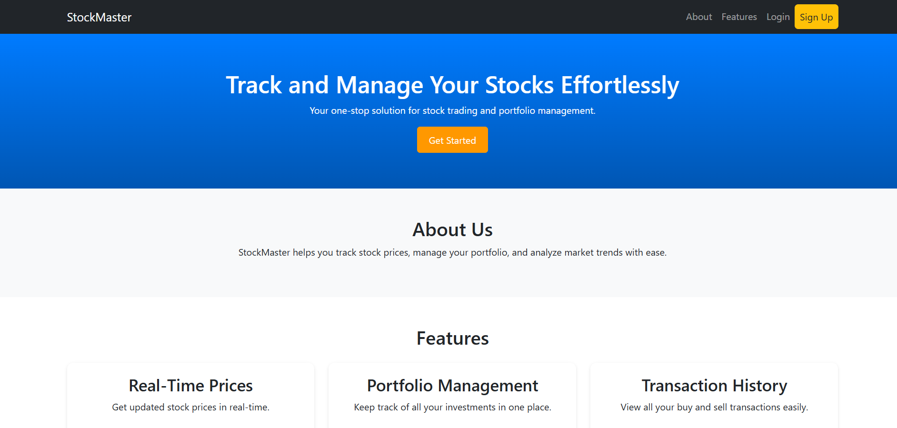

# 📈 StockMaster: Real-Time Stock Market Portfolio Management System

## 📌 Introduction

**StockMaster** is a powerful and intuitive stock market portfolio management system that allows users to track stock prices, manage their investments, and analyze market trends—all in real-time.  


---

## ✨ Features

✅ Real-time stock price updates  
✅ Seamless tracking of investments in a single dashboard  
✅ Intuitive UI to view all buy and sell transactions  
✅ Secure authentication and user portfolio management  

---

## ⚙️ Tech Stack

- **Frontend**: Bootstrap, HTML, CSS  
- **Backend**: Flask (Python)  
- **Database**: MongoDB  
- **APIs**: Alpha Vantage  

---

## 🛠️ Installation & Setup  

### 🔹 Running Locally

1. **Clone the repository**  
   ```bash
   git clone https://github.com/asanmo2004/Stock_Master.git
   cd Stock_Master

2. **Install dependencies**
   pip install flask flask-bcrypt pymongo

3. **Set up API keys**

Obtain an Alpha Vantage API Key from Alpha Vantage
Open app.py and paste the API Key in the designated variable

4. **Run the application** 
     python app.py

### 🔥 Key Improvements:

✅ **More engaging and professional introduction**  
✅ **Clearer feature list with checkmarks**  
✅ **Well-structured installation steps for easy setup**  
✅ **Code blocks for better readability**  
✅ **Encourages community engagement & contributions**  
---
## 📸 Screenshots

### 🔐 Welcome Page

### 🔐 Login Page


### 📨 Registration Page

### 📊 Seek Referrals

### 📊 Manage Incoming Requests

### 📊 Status Tracker

